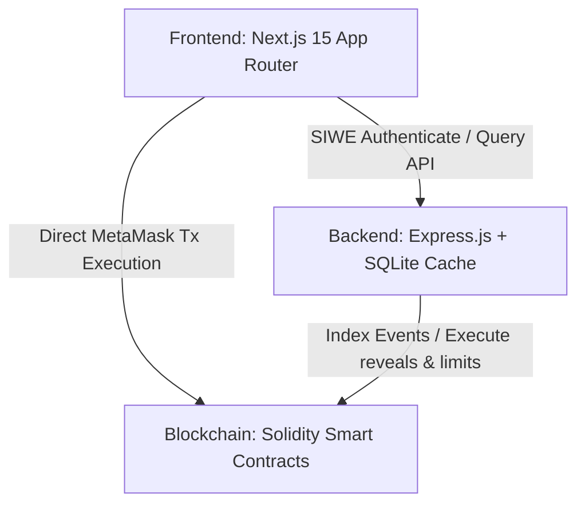

# Blume SX DeFi Trading Suite

A premium, state-of-the-art decentralized finance terminal combining perpetual futures trading, high-yield asset lending, leveraged spot limit orders, zero-knowledge commitment hidden orders, and a MultiSig governance administration panel.

---

## Workspace Architecture



- **`blockchain/`**: Ethereum/Solidity smart contracts built using Hardhat.
- **`backend/`**: Express & Socket.io server with Prisma & SQLite caching on-chain logs.
- **`frontend/`**: Next.js 15, Tailwind CSS, Recharts, and Ethers.js v6 trading interface.

---

## 1. Prerequisites

Ensure you have the following installed locally:
- **Node.js** (v18 or higher)
- **npm** (v9 or higher)
- **MetaMask Extension** (optional, for browser-based transaction confirmations)

---

## 2. Installation & Setup

Clone the repository and install dependencies in each directory:

### Root Repository
```bash
git clone <repo-url>
cd retest-7
```

### Smart Contracts (Blockchain)
```bash
cd blockchain
npm install
```

### Backend REST & WebSocket Server
```bash
cd ../backend
npm install
# Generate Prisma Client & initialize SQLite database cache
npx prisma generate
npx prisma db push
```

### Next.js Frontend App
```bash
cd ../frontend
npm install
```

---

## 3. Testing Guide

Execute unit and integration tests across both smart contracts and API controllers.

### Smart Contracts Unit Tests
Under the `blockchain/` folder:
```bash
cd blockchain
npx hardhat test
```
*Tests verify perpetual isolated/cross positions, 250% LTV borrow limits, spot limit order execution triggers, hidden commitments, and 3/3 MultiSig governance approval actions.*

### Backend Server Integration Tests
Under the `backend/` folder:
```bash
cd backend
npm run test
```
*Tests verify SIWE auth signatures, JWT session verification, profile endpoint data, and risk exposure updates.*
---
## DATABASE
npx prisma studio
npx ts-node scratch_show_tables.ts


## 4. Local Deployment & Node Start

To deploy contracts locally and start indexing real-time events:

### Step A: Spin Up Local Hardhat Node
```bash
cd blockchain
npx hardhat node
```
*This starts a local JSON-RPC provider on `http://127.0.0.1:8545` and outputs 20 developer private keys.*

### Step B: Deploy Contracts to Local Network
In a separate terminal, deploy the Solidity contracts:
```bash
cd blockchain
npx hardhat run scripts/deploy.js --network localhost
```
*Once deployed, the script will output the contract addresses (configured in backend & frontend).*

---

## 5. Running the Application

### Start Both Frontend and Backend Concurrently
Under the `frontend/` folder, running:
```bash
cd frontend
npm run dev
```
will concurrently start the frontend Next.js server on `http://localhost:3001` and the backend Express server on `http://localhost:3000`.

Alternatively, they can be started individually:

### Start the Backend Server
```bash
cd backend
npm run dev
```
*The Express server boots on `http://localhost:3000`.*

### Start the Next.js Frontend
```bash
cd frontend
npx next dev -p 3001
```
*Access the Web3 trading terminal in your browser at `http://localhost:3001`.*

---

## 6. Using the Trading Suite

1. **Sign-In (SIWE):** Visit `http://localhost:3001`. Connect your MetaMask wallet (configured for Localhost RPC) or click one of the pre-loaded **Developer Key** roles to sign the SIWE auth message.
2. **Deposit / Borrow:** Go to **Lending Pool** to deposit assets, view supply APYs, and borrow funds under the 250% LTV constraint.
3. **Execute Trades:** Go to **Perpetual Terminal** to manage positions with up to 1000x leverage.
4. **Governance:** Access **Admin Panel** to create multi-device proposals or toggle the emergency Master Kill Switch.
