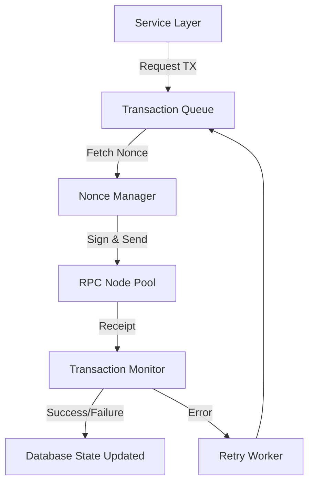

# Backend Development Roadmap - SX Trading Suite

This document outlines the complete backend development roadmap for the SX Trading Suite. It serves as a comprehensive, developer-ready specification for implementing a scalable, secure, and robust Node.js/TypeScript backend that integrates with our smart contract ecosystem.

---

## Phase 1 – Backend Architecture

The backend is structured to support high-throughput, low-latency financial transactions, real-time state synchronization, and cryptographically secure wallet operations.

### Technology Stack & Rationale

| Layer | Technology | Rationale |
| :--- | :--- | :--- |
| **Runtime & Framework** | Node.js (v20+) with Express | Offers rapid I/O execution, extensive library ecosystem, and high concurrency support for WebSocket/REST endpoints. |
| **Language** | TypeScript (v5+) | Provides strict type safety, aligning backend data contracts with smart contract structs and compile-time verification. |
| **Primary Database** | PostgreSQL (v16+) | Relational database offering ACID transactions, vital for position tracking, audit logs, and loan records. |
| **Cache & Pub/Sub** | Redis (v7+) | Used for session storage, request rate-limiting, and real-time WebSocket state distribution. |
| **Blockchain Client** | Ethers.js (v6+) | Lightweight library for EVM interactions, contract queries, gas estimations, and event indexing. |
| **ORM** | Prisma | Type-safe ORM for PostgreSQL that autogenerates client types and manages migrations cleanly. |
| **Authentication** | Sign-In with Ethereum (SIWE) + JWT | Passwordless, decentralised authentication via wallet signatures. Short-lived JWTs for API access. |
| **Queue System** | BullMQ | Redis-backed queue to handle transaction retries, historical indexing syncs, and heavy analytical jobs. |
| **File Storage** | AWS S3 or IPFS | Secure storage for encrypted KYC documents and dashboard reports. |
| **API Documentation** | Swagger / OpenAPI 3.0 | Auto-generated interactive API docs for internal and integration developer use. |
| **Deployment** | Docker & Kubernetes | Containerized microservices deploying to cloud environments with automated scaling. |

---

## Phase 2 – Project Structure

The project follows a modular, clean-architecture directory layout:

```
src/
 ├── config/            # Environment configurations, contract ABIs, and database connections
 ├── controllers/       # HTTP Request/Response handlers
 ├── services/          # Core business logic layers
 ├── routes/            # REST endpoint definitions and middleware hooks
 ├── middleware/        # Authentication, compliance, logging, and rate limiting filters
 ├── validators/        # Request body and query parameter validation schemas (Zod)
 ├── blockchain/        # Contract services, nonce managers, and RPC node connection pools
 ├── contracts/         # Saved JSON ABIs for deployed smart contracts
 ├── repositories/      # Database abstraction layer (direct Prisma queries)
 ├── models/            # Domain interfaces and custom types
 ├── database/          # Database migrations and seed scripts
 ├── events/            # Blockchain event listeners and event processors
 ├── websocket/         # WebSocket server managers and client connection state
 ├── scheduler/         # Cron job setup and task definitions
 ├── jobs/              # Background BullMQ worker task processors
 ├── utils/             # Loggers, math formatters, and environment validators
 ├── helpers/           # Cryptographic signature verifiers and formatting helpers
 ├── auth/              # JWT issuance, refresh, and SIWE nonce stores
 ├── admin/             # Multisig proposal management services
 ├── rewards/           # Reward accumulation and distribution formulas
 ├── compliance/        # KYC/AML verification filters
 ├── monitoring/        # Prometheus metrics configurations
 └── tests/             # Unit, integration, and mock suites
```

### Folder Responsibilities

* **`config`**: Validates environmental inputs at boot-up. Holds configuration templates for RPC endpoints.
* **`controllers`**: Decouples HTTP networking from core logic. Validates HTTP input and delegates task handling to the service layer.
* **`services`**: Contains all complex business logic, including PnL projections, risk metrics, and multisig proposal compilation.
* **`routes`**: Maps REST endpoints to middleware chains and target controller functions.
* **`middleware`**: Inspects sessions, checks role permissions, logs network latencies, and restricts requests via rate-limiters.
* **`validators`**: Schema definitions that reject malformed payloads before they reach controllers.
* **`blockchain`**: Interacts directly with target smart contracts. Handles RPC fallbacks, gas estimation, and raw transaction signing.
* **`contracts`**: Serves as the central repository for compiled smart contract JSON ABIs.
* **`repositories`**: Encapsulates DB calls. Prevents leaking ORM details to services.
* **`events`**: Processes events emitted from contracts (e.g., perpetual closures) and records them in PostgreSQL.
* **`websocket`**: Publishes low-latency position changes, price variations, and notifications to active connections.
* **`scheduler`**: Schedules background operations (e.g., interest accrual calculations) at fixed intervals.
* **`jobs`**: Processes tasks from the queue asynchronously.
* **`utils`**: Houses globally accessible modules like the Logger and general math helpers.
* **`auth`**: Manages user authentication lifecycles.
* **`compliance`**: Manages KYC status and AML blacklists.
* **`monitoring`**: Exposes `/metrics` endpoint for Prometheus scraping.

---

## Phase 3 – Backend Modules

### 1. Authentication & KYC Module
* **Purpose**: Registers wallets, issues authentication tokens, and manages compliance.
* **Responsibilities**:
  * Generate cryptographically unique SIWE nonces.
  * Verify wallet signatures.
  * Issue and refresh JWT tokens.
  * Monitor KYC verification status.
* **Dependencies**: Redis (for nonce storage), Database.
* **Services**: `AuthService`, `KycService`
* **Controllers**: `AuthController`, `KycController`
* **Routes**: `/api/auth/*`, `/api/kyc/*`
* **Database Tables**: `users`, `wallets`
* **Blockchain Interaction**: None (Off-chain signature verification).

### 2. Perpetual Trading Module
* **Purpose**: Coordinates off-chain position tracking, funding tracking, and execution requests.
* **Responsibilities**:
  * Track active positions.
  * Compute real-time funding indices.
  * Predict liquidations and margin status.
* **Dependencies**: `BlockchainModule`, `MockOracle`, `SXPT` contract.
* **Services**: `PerpService`, `FundingService`
* **Controllers**: `PerpController`
* **Routes**: `/api/perpetual/*`
* **Database Tables**: `perpetual_positions`, `funding_history`
* **Blockchain Interaction**: Queries `SXPT` for position state and funding indexes.

### 3. Asset Lending Module
* **Purpose**: Manages lending pool states, borrow tracking, and LTV risk monitoring.
* **Responsibilities**:
  * Track deposited collateral values.
  * Monitor active borrow balances.
  * Alert on LTV violations (threshold < 250%).
* **Dependencies**: `SXLT` contract, `MockOracle`.
* **Services**: `LendingService`, `InterestService`
* **Controllers**: `LendingController`
* **Routes**: `/api/lending/*`
* **Database Tables**: `lending_loans`
* **Blockchain Interaction**: Reads LTV and interest rates from `SXLT` contract.

### 4. Leveraged Spot Module
* **Purpose**: Tracks spot orders, Limit Order queues, and TP/SL execution.
* **Responsibilities**:
  * Track active spot positions.
  * Manage limit orders in database.
  * Update TP/SL trigger levels.
* **Dependencies**: `SXLS` contract, `MockOracle`.
* **Services**: `SpotService`, `LimitOrderService`
* **Controllers**: `SpotController`
* **Routes**: `/api/spot/*`
* **Database Tables**: `leveraged_spots`
* **Blockchain Interaction**: Interacts with `SXLS` to open, close, and update spot orders.

### 5. Hidden Order Module
* **Purpose**: Manages hidden order commitments, ZK-simulation parameters, and automated executions.
* **Responsibilities**:
  * Store hidden order commitments.
  * Generate details for reveal execution.
  * Automate submission of execution transactions.
* **Dependencies**: `SXHOP` contract, `SXLS` contract.
* **Services**: `HiddenOrderService`
* **Controllers**: `HiddenOrderController`
* **Routes**: `/api/hidden/*`
* **Database Tables**: `hidden_orders`
* **Blockchain Interaction**: Submits reveal transactions to `SXHOP`.

---

## Phase 4 – REST APIs

### Auth & Compliance Endpoints

#### `POST /api/auth/nonce`
* **Purpose**: Generates a cryptographic nonce for Sign-In with Ethereum (SIWE).
* **Request Body**:
  ```json
  { "address": "0x70997970C51812dc3A010C7d01b50e0d17dc79C8" }
  ```
* **Response (200)**:
  ```json
  { "nonce": "XYZ12345" }
  ```
* **Validation**: Required valid EVM wallet address.
* **Authentication**: None.

#### `POST /api/auth/verify`
* **Purpose**: Verifies the signature from the wallet and issues JWT tokens.
* **Request Body**:
  ```json
  {
    "message": "SIWE message template...",
    "signature": "0xabc..."
  }
  ```
* **Response (200)**:
  ```json
  {
    "accessToken": "eyJhbG...",
    "refreshToken": "eyJhbG..."
  }
  ```
* **Validation**: Valid signature for the generated nonce.
* **Authentication**: None.

---

### Trading & Lending Endpoints

#### `POST /api/perpetual/open`
* **Purpose**: Prepares a transaction to open a perpetual position.
* **Request Body**:
  ```json
  {
    "asset": "0xMockAssetAddress...",
    "leverage": 10,
    "marginAmount": "100.0",
    "isLong": true,
    "isCross": false
  }
  ```
* **Response (200)**:
  ```json
  {
    "to": "0xSXPTContractAddress...",
    "data": "0x...",
    "gasEstimate": "150000"
  }
  ```
* **Authentication**: Required JWT.

#### `POST /api/lending/borrow`
* **Purpose**: Initiates a borrow request, verifying LTV boundaries.
* **Request Body**:
  ```json
  {
    "borrowAsset": "0xUSDT...",
    "borrowAmount": "100.0",
    "collateralAsset": "0xMockToken...",
    "collateralAmount": "50.0"
  }
  ```
* **Response (200)**:
  ```json
  {
    "to": "0xSXLTContract...",
    "data": "0x..."
  }
  ```
* **Authentication**: Required JWT.
* **Error Codes**: `ERR_LTV_VIOLATION` (LTV < 250%).

#### `POST /api/spot/open`
* **Purpose**: Prepares a leveraged spot position transaction (Market or Limit).
* **Request Body**:
  ```json
  {
    "targetAsset": "0xMockToken...",
    "collateralAmount": "100.0",
    "leverage": 3,
    "isLimit": true,
    "triggerPrice": "8.5"
  }
  ```
* **Response (200)**:
  ```json
  {
    "to": "0xSXLSContract...",
    "data": "0x..."
  }
  ```
* **Authentication**: Required JWT.

#### `POST /api/hidden/place`
* **Purpose**: Registers a hidden order commitment with simulated ZK-proofs.
* **Request Body**:
  ```json
  {
    "commitment": "0xhash...",
    "proof": "0xproof..."
  }
  ```
* **Response (200)**:
  ```json
  {
    "orderId": 1,
    "status": "Pending"
  }
  ```
* **Authentication**: Required JWT.

---

### Dashboard & Analytics Endpoints

#### `GET /api/dashboard`
* **Purpose**: Fetches aggregate user exposure, collateral value, and risk score.
* **Response (200)**:
  ```json
  {
    "totalExposureUSD": "1400.00",
    "totalCollateralUSD": "700.00",
    "riskScore": 100.0,
    "activePositionsCount": 3
  }
  ```
* **Authentication**: Required JWT.

---

## Phase 5 – Blockchain Integration

The backend interacts with the smart contract ecosystem using a dedicated execution service.



### Contract Service Interface Definitions

#### `SXPTService`
* **Read Functions**:
  * `positions(uint256)`: Returns user position parameters.
  * `cumulativeFundingIndex(address)`: Returns current index value.
* **Write Functions**:
  * `openPerpetualPosition(...)`
  * `closePerpetualPosition(...)`
  * `applyFundingDeduction(...)`
* **Transaction Monitoring**:
  * Auto-tracks confirmations (target: 3 block confirmations).
  * Auto-resubmits with 15% higher gas price if unconfirmed after 45 seconds.

#### `SXHOPService`
* **Read Functions**:
  * `getOrderStatus(uint256)`: Returns order state (Pending/Executed/Cancelled).
* **Write Functions**:
  * `executeHiddenOrder(uint256, bytes, bytes)`: Revealing the hidden parameters to execute on-chain.
* **Nonce Management**:
  * Employs Redis-based locking to coordinate writing transaction counts concurrently without collisions.

---

## Phase 6 – Event Indexing

Event indexing captures contract state changes and synchronises them with PostgreSQL for dashboard display.

```
[Blockchain Events] ➔ [Ethers Event Listener] ➔ [BullMQ Ingest Queue] ➔ [Event Handler Workers] ➔ [PostgreSQL]
```

### Event Handler Registrations

| Event Signature | Parameters Captured | DB Target Table | Action |
| :--- | :--- | :--- | :--- |
| `PerpetualPositionOpened` | `posId, user, asset, leverage, margin, isLong` | `perpetual_positions` | Inserts new position record. |
| `PerpetualPositionClosed` | `posId, user, finalPnL, payoutAmount` | `perpetual_positions` | Sets position `isOpen = false` and writes PnL. |
| `FundingRateApplied` | `posId, fundingDeduction, currentFundingIndex` | `funding_history` | Inserts historical ledger entry. |
| `LoanCreated` | `loanId, user, borrowAsset, borrowAmount, collateralAsset` | `lending_loans` | Inserts active loan record. |
| `LoanRepaid` | `loanId, user, repayAmount` | `lending_loans` | Updates loan balances or sets `isOpen = false`. |
| `LeveragedSpotOpened` | `posId, user, targetAsset, leverage, size` | `leveraged_spots` | Creates active spot records. |
| `LeveragedSpotClosed` | `posId, user, finalPnL, payout` | `leveraged_spots` | Archives record with final payoff calculations. |
| `HiddenOrderPlaced` | `orderId, commitment` | `hidden_orders` | Inserts pending order details. |
| `HiddenOrderExecuted` | `orderId, executor` | `hidden_orders` | Marks order as executed. |
| `ProposalExecuted` | `proposalId` | `proposals` | Updates execution status. |
| `KillSwitchActivated` | `None` | `system_settings` | Enforces global maintenance pause state in API. |

---

## Phase 7 – Database Design

The PostgreSQL relational schema is managed via Prisma.

```prisma
datasource db {
  provider = "postgresql"
  url      = env("DATABASE_URL")
}

generator client {
  provider = "prisma-client-js"
}

model User {
  id             String      @id @default(uuid())
  address        String      @unique
  kycStatus      String      @default("PENDING") // PENDING, APPROVED, REJECTED
  createdAt      DateTime    @default(now())
  updatedAt      DateTime    @updatedAt
  wallet         Wallet?
  perps          PerpetualPosition[]
  loans          LendingLoan[]
  spots          LeveragedSpot[]
  hiddenOrders   HiddenOrder[]
  auditLogs      AuditLog[]
  proposals      Proposal[]  @relation("Creator")
  approvals      ProposalApproval[]
}

model Wallet {
  id         String   @id @default(uuid())
  userId     String   @unique
  user       User     @relation(fields: [userId], references: [id])
  address    String   @unique
  balanceUSD Decimal  @default(0.0)
  createdAt  DateTime @default(now())
}

model PerpetualPosition {
  id           String   @id @default(uuid())
  posId        Int      @unique
  userId       String
  user         User     @relation(fields: [userId], references: [id])
  asset        String
  leverage     Int
  marginAmount Decimal
  size         Decimal
  isLong       Boolean
  isCross      Boolean
  isOpen       Boolean  @default(true)
  entryPrice   Decimal
  pnl          Decimal?
  createdAt    DateTime @default(now())
}

model LendingLoan {
  id               String   @id @default(uuid())
  loanId           Int      @unique
  userId           String
  user             User     @relation(fields: [userId], references: [id])
  borrowAsset      String
  borrowAmount     Decimal
  collateralAsset  String
  collateralAmount Decimal
  isOpen           Boolean  @default(true)
  createdAt        DateTime @default(now())
}

model LeveragedSpot {
  id               String   @id @default(uuid())
  posId            Int      @unique
  userId           String
  user             User     @relation(fields: [userId], references: [id])
  targetAsset      String
  collateralAmount Decimal
  leverage         Int
  size             Decimal
  isLimit          Boolean
  triggerPrice     Decimal?
  takeProfit       Decimal?
  stopLoss         Decimal?
  isPending        Boolean  @default(false)
  isOpen           Boolean  @default(true)
  createdAt        DateTime @default(now())
}

model HiddenOrder {
  id         String   @id @default(uuid())
  orderId    Int      @unique
  userId     String
  user       User     @relation(fields: [userId], references: [id])
  commitment String   @unique
  status     String   @default("PENDING") // PENDING, EXECUTED, CANCELLED
  createdAt  DateTime @default(now())
}

model FundingHistory {
  id           String   @id @default(uuid())
  posId        Int
  deduction    Decimal
  indexAtApply Decimal
  timestamp    DateTime @default(now())
}

model Proposal {
  id          String             @id @default(uuid())
  proposalId  Int                @unique
  creatorId   String
  creator     User               @relation("Creator", fields: [creatorId], references: [id])
  target      String
  data        String
  executed    Boolean            @default(false)
  approvals   ProposalApproval[]
  createdAt   DateTime           @default(now())
}

model ProposalApproval {
  id         String   @id @default(uuid())
  proposalId String
  proposal   Proposal @relation(fields: [proposalId], references: [id])
  approverId String
  approver   User     @relation(fields: [approverId], references: [id])
  createdAt  DateTime @default(now())
}

model AuditLog {
  id        String   @id @default(uuid())
  userId    String?
  user      User?    @relation(fields: [userId], references: [id])
  action    String
  details   String
  ipAddress String
  timestamp DateTime @default(now())
}
```

---

## Phase 8 – Authentication & Authorization

Authentication is passwordless and relies on the user's web3 wallet signature.

```
1. Client requests Nonce ➔ 2. Backend returns Nonce + Stores in Redis (TTL: 5m)
3. Client signs Nonce ➔ 4. Client sends Signature to /api/auth/verify
5. Backend verifies signature matches address ➔ 6. Backend returns Access + Refresh Token
```

### Authorization Role Model

* **Super Admin**: Full database access. Can propose multi-sig updates.
* **Operator**: Can process off-chain oracle updates and monitor system health.
* **User**: Standard client access (authorized trading, lending, dashboard querying).

---

## Phase 9 – Validation

All API validation is handled by middleware executing Zod schemas.

### Validation Rules

```typescript
import { z } from "zod";

export const OpenPerpSchema = z.object({
  body: z.object({
    asset: z.string().regex(/^0x[a-fA-F0-9]{40}$/, "Invalid ERC20 Address"),
    leverage: z.number().int().min(2).max(1000, "Leverage must be between 2x and 1000x"),
    marginAmount: z.string().refine(val => !isNaN(Number(val)) && Number(val) > 0, "Margin must be positive number"),
    isLong: z.boolean(),
    isCross: z.boolean()
  })
});
```

---

## Phase 10 – Background Jobs

Background scheduling is handled by BullMQ and Redis.

| Job Name | Interval | Purpose |
| :--- | :--- | :--- |
| **Funding Rate Tracker** | Every 1 Hour | Invokes `updateFunding()` on the `SXPT` contract if open skew has updated. |
| **Interest Calculator** | Every 1 Day | Estimates accrued interest on outstanding loans for dashboard previews. |
| **Limit Order Executor** | Every 30 Seconds | Scans the database for pending limit orders and triggers executing transactions when price targets are hit. |
| **Expired Order Cleanup**| Every 1 Hour | Cancels pending hidden orders older than their expiration limits. |
| **Backup Runner** | Every 24 Hours | Generates snapshots of the PostgreSQL database. |

---

## Phase 11 – WebSocket Services

Real-time notification feeds are processed using the Socket.io protocol.

### Channels & Payloads

* `subscribe("user:<address>")`: Subscribes to private user updates.
  * **Event**: `position_update`
  * **Payload**:
    ```json
    { "type": "PERPETUAL", "id": 1, "status": "Closed", "pnl": "15.42" }
    ```
* `subscribe("rates")`: Broadcasts global updates.
  * **Event**: `funding_update`
  * **Payload**:
    ```json
    { "asset": "0xMockAsset...", "rate": "0.00015" }
    ```

---

## Phase 12 – Security

The backend enforces strict security parameters to protect user balances and avoid protocol exploits.

```
[Request] ➔ [Helmet HTTP Headers] ➔ [Rate Limiter] ➔ [CORS Verification] ➔ [JWT Verification] ➔ [Access Level Checks] ➔ [Controller]
```

### Security Measures

1. **Rate Limiting**: Limits standard users to 100 requests per 15 minutes. Restricted endpoints (e.g. auth validation) are capped at 5 attempts per minute.
2. **Replay Protection**: Cryptographic nonces generated by the API expire after 5 minutes and can only be used once.
3. **CORS Configuration**: Restricts access to whitelist domains (production frontend, block explorers).
4. **Input Sanitization**: Rejects requests containing HTML/JS injection payloads. Escapes SQL inputs using Prisma parameterized queries.

---

## Phase 13 – Testing

The project targets a minimum test coverage metric of 90% across the codebase.

```
Total Coverage Target: 95% Core Services, 90% API Controllers
```

### Test Suite Types

* **Unit Testing**: Tests services, helper functions, and validators isolated from dependencies (using Mock database clients).
* **Integration Testing**: Tests Express endpoints calling local PostgreSQL and Redis instances.
* **Blockchain Tests**: Tests transactions using local Hardhat nodes.

---

## Phase 14 – Deployment

The production infrastructure is containerized and orchestrated.

### Docker Environment Configuration (`docker-compose.prod.yml`)

```yaml
version: '3.8'

services:
  api:
    build:
      context: .
      dockerfile: Dockerfile
    environment:
      - NODE_ENV=production
      - PORT=3000
    ports:
      - "3000:3000"
    depends_on:
      - postgres
      - redis

  postgres:
    image: postgres:16-alpine
    environment:
      POSTGRES_DB: sx_trading
      POSTGRES_USER: admin
      POSTGRES_PASSWORD: securepassword

  redis:
    image: redis:7-alpine
    command: redis-server --requirepass securepassword
```

---

## Phase 15 – Monitoring

Monitoring exposes system health parameters to prevent outages.

* **Metrics collection**: Exposes Prometheus metrics via `/metrics` capturing memory/CPU footprints and API latencies.
* **Error Tracking**: Sends uncaught runtime exceptions to Sentry for debugging.
* **RPC Healthchecks**: Tracks RPC latency and automatically fails over if latency exceeds 800ms.

---

## Phase 16 – Final Deliverables

This implementation checklist tracks the completion of each backend deliverable:

* [ ] **Phase 1 – Backend Architecture Setup**
  * [ ] Initialize TypeScript boilerplate template.
  * [ ] Connect to local PostgreSQL and Redis instances.
* [ ] **Phase 2 – Database & Models**
  * [ ] Setup Prisma client models.
  * [ ] Generate and apply baseline database migrations.
* [ ] **Phase 3 – Authentication & SIWE**
  * [ ] Write SIWE nonce generation endpoint.
  * [ ] Implement cryptographic signature verifier middleware.
* [ ] **Phase 4 – Contract Interaction Service**
  * [ ] Export compiled smart contract ABIs.
  * [ ] Implement Ethers.js transaction signer service.
* [ ] **Phase 5 – Event Indexer Sync**
  * [ ] Build real-time event indexing listeners.
  * [ ] Create workers to ingest events into PostgreSQL.
* [ ] **Phase 6 – REST API Modules**
  * [ ] Implement Perpetual, Spot, and Lending controller routers.
  * [ ] Add input validators for all route payloads.
* [ ] **Phase 7 – WebSocket Updates**
  * [ ] Setup Socket.io broadcast rooms.
  * [ ] Integrate database change triggers with WebSocket emission events.
* [ ] **Phase 8 – Deployment Verification**
  * [ ] Write production Dockerfile templates.
  * [ ] Deploy to local test staging environment.
